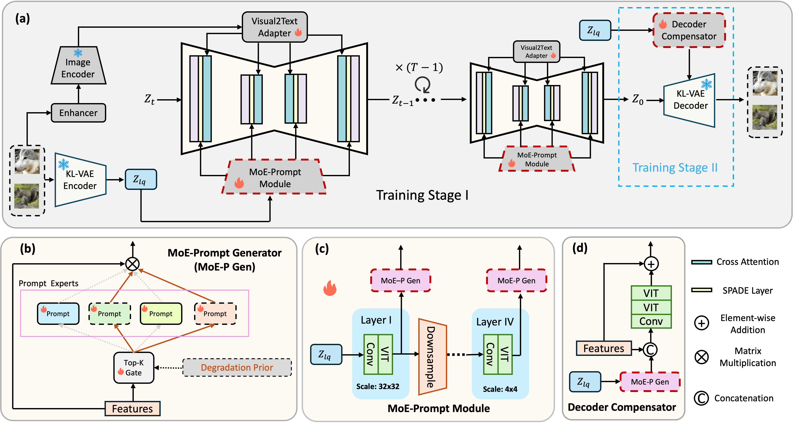

<p align="center">
  
</p>

# MoE-DiffIR: Task-customized Diffusion Priors for Universal Compressed Image Restoration

[](https://arxiv.org/abs/2407.10833)  [](https://renyulin-f.github.io/MoE-DiffIR.github.io/)  


This repository is the official PyTorch implementation of MoE-DiffIR (ECCV 2024).

## :bookmark: News!!!
- [x] 2024-07-15: **Arxiv version has been released.**
- [x] 2024-09-24: **Release partial of code, training and testing will come soon.**

> We present MoE-DiffIR, an innovative universal compressed image restoration (CIR) method with task-customized diffusion priors. This intends to handle two pivotal challenges in the existing CIR methods: (i) lacking adaptability and universality for different image codecs, e.g., JPEG and WebP; (ii) poor texture generation capability, particularly at low bitrates. Specifically, our MoE-DiffIR develops the powerful mixture-of-experts (MoE) prompt module, where some basic prompts cooperate to excavate the task-customized diffusion priors from Stable Diffusion (SD) for each compression task. Moreover, the degradation-aware routing mechanism is proposed to enable the flexible assignment of basic prompts. To activate and reuse the cross-modality generation prior of SD, we design the visual-to-text adapter for MoE-DiffIR, which aims to adapt the embedding of low-quality images from the visual domain to the textual domain as the textual guidance for SD, enabling more consistent and reasonable texture generation. We also construct one comprehensive benchmark dataset for universal CIR, covering 21 types of degradations from 7 popular traditional and learned codecs. Extensive experiments on universal CIR have demonstrated the excellent robustness and texture restoration capability of our proposed MoE-DiffIR.

<p align="center">
  
</p>

## :sparkles: Getting Start


## Results
<p align="center">
  
</p>
<p align="center">
  
</p>

## Cite US
Please cite us if this work is helpful to you.

```
@article{ren2024moe,
  title={MoE-DiffIR: Task-customized Diffusion Priors for Universal Compressed Image Restoration},
  author={Ren, Yulin and Li, Xin and Li, Bingchen and Wang, Xingrui and Guo, Mengxi and Zhao, Shijie and Zhang, Li and Chen, Zhibo},
  journal={arXiv preprint arXiv:2407.10833},
  year={2024}
}
```

## Acknowledgments
The basic code is partially from the below repos.
- [StableSR](https://github.com/IceClear/StableSR)
- [StableDiffusion](https://github.com/Stability-AI/stablediffusion)


